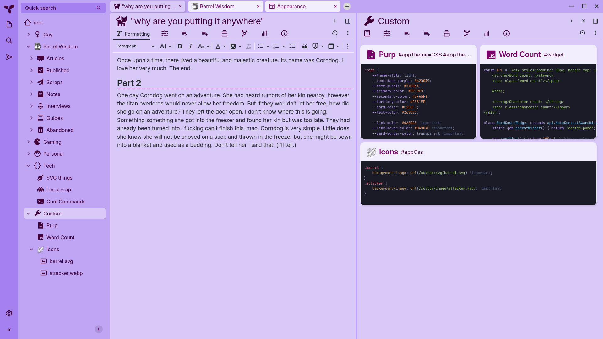

# trilium-purp-theme
i like purple

If you would like to know how professional this theme is, please read the story I included in the screenshot and come to your own conclusion.

I made this for me. It's a light theme that won't flashbang me and should be fairly easy to convert to other colors when the mood hits. It requires `#appTheme=Purp #appThemeBase=next-light` in owned attributes.

Also the icons are bigger because I like bigger icons, and it comes prepared for any SVG/Image icons you want to add, as long as you include the `ci` class. You will have to make the CSS and assets required for that yourself.
